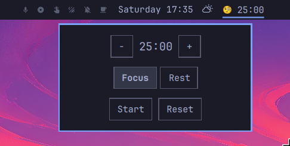

# TomaTask — Your Friendly Neighborhood Tomato Timer

Track your Pomodoro sessions directly from your Omarchy bar.

A tiny, simple, no-nonsense Pomodoro timer.

Start, stop, and reset sessions
Switch between Focus and Rest modes
Default durations: 25-minute Focus and 5-minute Rest sessions
Adjust the timer to match your workflow

## To Add Tomatask to Your Omarchy 4 Quattro
>omarchy plugin add https://github.com/sudhakarkarunaiprakasam/tomatask --enable

## To Remove Tomatask from Your Omarchy 4 Quattro
>omarchy plugin remove sudhakar.tomatask